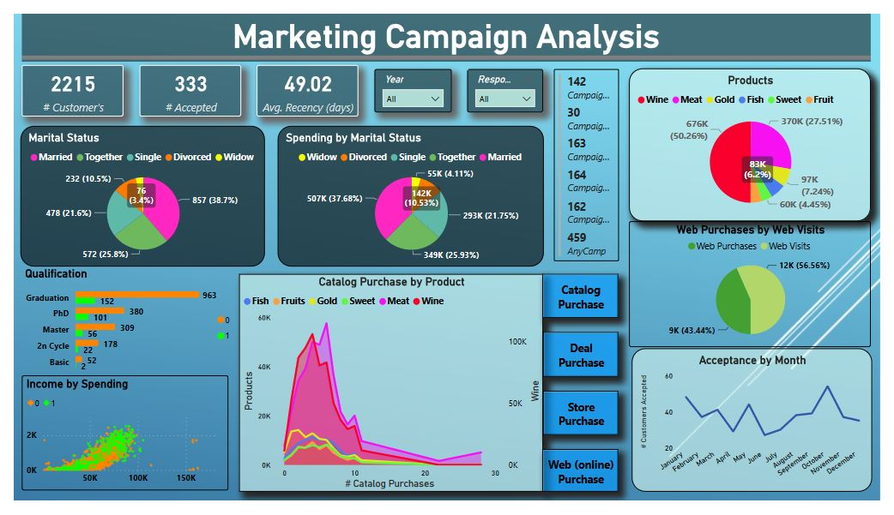

# Marketing Campaign Analysis

### Problem Statement
A Marketing company is facing low response rates to their marketing campaigns. The objective of this project is to conduct thorough Exploratory Data Analysis, extracting insights through univariate and bivariate analysis. And Recommended strategic customer targeting tactics. 

To predict customer response to an offer for a specific product or service, enabling targeted marketing strategies and optimizing campaign effectiveness.

###


## Content
[1. Loading libraries and data](https://github.com/patilkiran123/Marketing-Campaign-Analysis#1-loading-libraries-and-data)  
[2. Reading data documentation](https://github.com/patilkiran123/Marketing-Campaign-Analysis#2-reading-data-documentation)  
[3. Exploring data (Exploratory Data Analysis)](https://github.com/patilkiran123/Marketing-Campaign-Analysis#3-exploring-data-exploratory-data-analysis)  
-3.1 Univariate data analysis  
-3.2 Bivariate data analysis  
[4. Data Preparation and Splitting](https://github.com/patilkiran123/Marketing-Campaign-Analysis#4-data-preparation-and-splitting)  
[5. Model Selection and Training](https://github.com/patilkiran123/Marketing-Campaign-Analysis#5-model-selection-and-training)  
[6. Evaluating Model Performance](https://github.com/patilkiran123/Marketing-Campaign-Analysis#6-evaluating--model-performance)  
[7. Conclusion](https://github.com/patilkiran123/Marketing-Campaign-Analysis#7-conclusion)  
[8. Deployment phase](https://github.com/patilkiran123/Marketing-Campaign-Analysis#8-deployment-phase)  
___
### 1. Loading libraries and data
```
import numpy as np
import pandas as pd
import matplotlib.pyplot as plt
```
___
### 2. Reading data documentation

It is important to understand the meaning behind each column and how they were built.   
Here’s the list of variables and their meaning, taken from the data source:

```
# People
ID: Customer's unique identifier
Year_Birth: Customer's birth year
Education: Customer's education level
Marital_Status: Customer's marital status
Income: Customer's yearly household income
Kidhome: Number of children in customer's household
Teenhome: Number of teenagers in customer's household
Dt_Customer: Date of customer's enrollment with the company
Recency: Number of days since customer's last purchase
Complain: 1 if the customer complained in the last 2 years, 0 otherwise

# Products
MntWines: Amount spent on wine in last 2 years
MntFruits: Amount spent on fruits in last 2 years
MntMeatProducts: Amount spent on meat in last 2 years
MntFishProducts: Amount spent on fish in last 2 years
MntSweetProducts: Amount spent on sweets in last 2 years
MntGoldProds: Amount spent on gold in last 2 years

# Promotion
NumDealsPurchases: Number of purchases made with a discount
AcceptedCmp1: 1 if customer accepted the offer in the 1st campaign, 0 otherwise
AcceptedCmp2: 1 if customer accepted the offer in the 2nd campaign, 0 otherwise
AcceptedCmp3: 1 if customer accepted the offer in the 3rd campaign, 0 otherwise
AcceptedCmp4: 1 if customer accepted the offer in the 4th campaign, 0 otherwise
AcceptedCmp5: 1 if customer accepted the offer in the 5th campaign, 0 otherwise
*Response*: 1 if customer accepted the offer in the last campaign, 0 otherwise

# Place
NumWebPurchases: Number of purchases made through the company’s website
NumCatalogPurchases: Number of purchases made using a catalogue
NumStorePurchases: Number of purchases made directly in stores
NumWebVisitsMonth: Number of visits to company’s website in the last month
```
> there are two variables that are not in that list: Z_CostContact and Z_Revenue, which are always equal to 3 and 11, respectively. I assume they mean the cost of contacting a customer and the associated revenue if a customer accepts the offer.
___  
### 3. Exploring data *(Exploratory Data Analysis)*

3.1 Univariate data analysis

3.1.1 Numeric data  
('Year_Birth', 'Income', 'Kidhome','Teenhome','Recency', 'MntWines', 'MntFruits','MntMeatProducts', 'MntFishProducts', 'MntSweetProducts', 'MntGoldProds', 'NumDealsPurchases', 'NumWebPurchases','NumCatalogPurchases', 'NumStorePurchases', 'NumWebVisitsMonth' )

3.1.2 Categorical data  
    ('AcceptedCmp1', 'AcceptedCmp2', 'AcceptedCmp3','AcceptedCmp4', 'AcceptedCmp5', 'Complain', 'Response', 'Marital_Status', 'Education')

3.1.3 Date  
    Dt_Customer


3.2 Bivariate data analysis
- scatter_matrix for all variables
- Number of Kids and Teens over Time
- Amount Spent per Product over Time
- Type of Purchase over Time
- Complain, Response, and Acceptance over Time

As we are not only conducting exploratory data analysis (EDA) but also developing models where our target variable will be predicting "Response," it is important to analyze how certain variables relate to our target. In particular, we will examine the following relationships:
- Marital Status vs. Education
- Marital Status vs. Response
- Education vs. Response

By exploring these associations, we can gain insights into the influence of marital status, education level, and their combined impact on the response variable. This analysis will contribute to our understanding of the factors that potentially influence customer responses and guide our modeling efforts.

~~3.3 Multivariate data analysis~~
___
### 4. Data Preparation and Splitting   
4.1 Data Preparation: Clean and preprocess the collected data to make it suitable for analysis. This step involves handling missing values, dealing with outliers, encoding categorical variables, scaling or normalizing features, and any other necessary transformations.  
Preprocessing ensures the data is in a consistent and appropriate format for modeling.

4.2 Split the Data: Split your dataset into training and testing sets. The training set will be used to train the model, while the testing set will be used to evaluate its performance.
___
### 5. Model Selection and Training  
Model selection involves choosing the architecture and type of model that best suits the problem at hand.     
1. Logistic Regression: A classification algorithm used for predicting binary outcomes based on input features.
2. Decision Trees: A tree-like model used for classification and regression tasks, where each internal node represents a feature, each branch represents a decision, and each leaf node represents an outcome.
3. Random Forest: An ensemble learning method that combines multiple decision trees to improve predictive accuracy and reduce overfitting.
4. Gradient Boosting: An ensemble technique that builds multiple weak learners (typically decision trees) sequentially, with each one correcting the errors of its predecessor, leading to improved model performance.
  

___
### 6. Evaluating  Model Performance  
Evaluate and compare the performance of each model on the testing data using appropriate evaluation metrics.(such as accuracy, precision, recall, F1 score) This will help us assess how well each model performs and determine their relative strengths and weaknesses.
___
### 7. Conclusion
Based on the results obtained from the resampled data, it is evident that the Random Forest and Decision Tree models have performed the best. Since our business problem focuses on "enabling targeted marketing strategies and optimizing campaign effectiveness," the key criteria for selecting the best model are accuracy and f1 scores.

Among the two models, the Random Forest model stands out with the highest accuracy of 95.47% and the best f1 score of 95.60%. These metrics indicate that the Random Forest model demonstrates excellent predictive capabilities and can effectively identify positive and negative responses from customers, making it a reliable and effective model for the task at hand.

Therefore, it is recommended to utilize the Random Forest model for predicting customer responses in your marketing campaigns. Its high accuracy and f1 scores make it a suitable choice for enabling targeted marketing strategies, ensuring that the campaigns are more efficient and successful in reaching the right audience and optimizing overall campaign effectiveness.

___

### 8. Deployment phase

